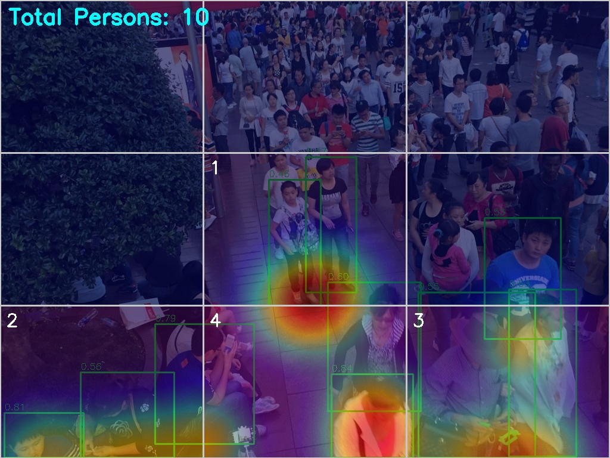
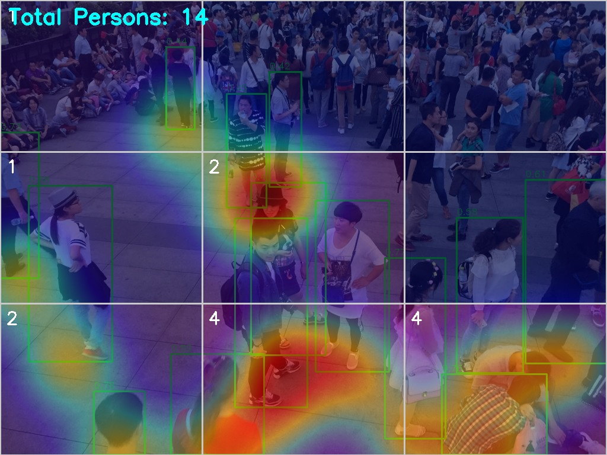
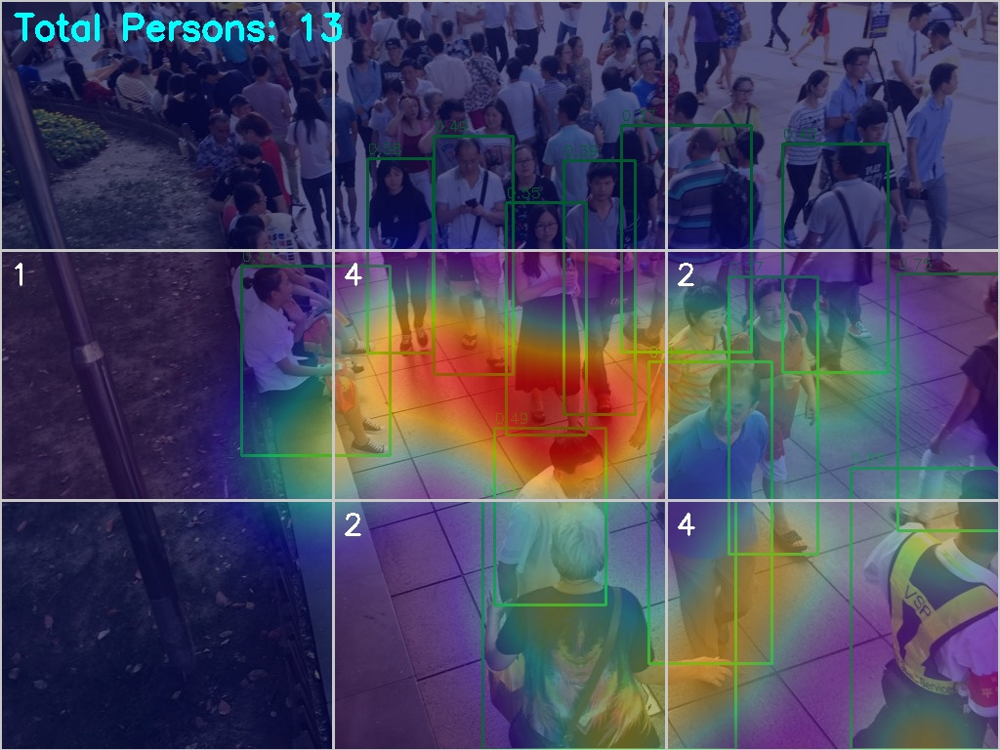
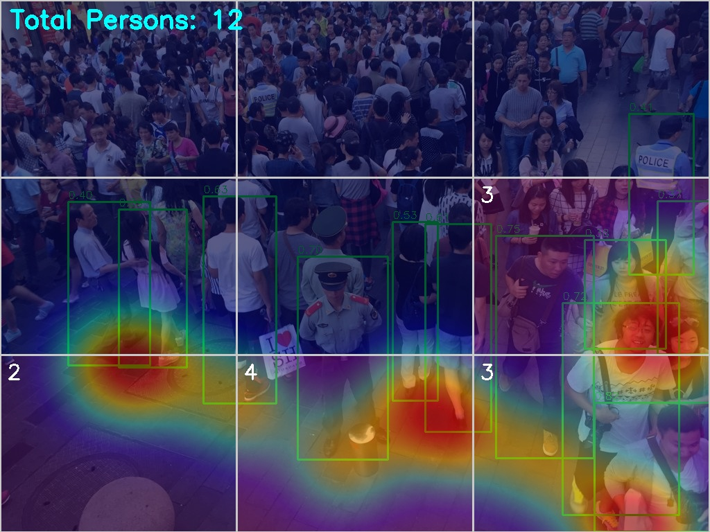

# CrowdCluster-YOLOv8

Person detection and spatial density analysis system using YOLOv8 over static images and video. Built as a direct evolution of [CrowdClusterLocator](https://github.com/GeoCd/crowd-cluster-locator), which implemented a Winner-Takes-All network from scratch for spatial clustering of detections.

---

## What it does

Given an image or video, the system detects people using the YOLOv8s model, extracts their spatial positions and analyzes density distribution across configurable zones. Results are visualized as a Gaussian heatmap, a zone grid with per-cell counts or both simultaneously.

---

## How it works

### Detection
YOLOv8s pretrained on COCO is used filtering only class 0 (person). The model runs out of the box with confidence and IOU thresholds configurable in `config.py`.

### Spatial position
The bottom center of each bounding box is used as the person's ground position rather than the geometric center, which gives a more accurate spatial reference for people at different depths in the scene.

### Zone analysis
The frame is divided into a configurable GRID_ROWS x GRID_COLS grid. Each detection is assigned to a cell based on its position, producing a count matrix. Zones at or above `DENSITY_ALERT_THRESHOLD` are highlighted with a red border.

### Density heatmap
A Gaussian distribution is accumulated per detection using OpenCV's GaussianBlur, then mapped to JET colormap and blended over the original frame. Radius and transparency are configurable.

---

## Pipeline

```
Input (image / video / webcam)
    |
    v
YOLOv8s inference — class 0 filter
    |
    v
Bounding box extraction
    |
    v
Bottom-center centroid per detection
    |
    v
Zone assignment (GRID_ROWS x GRID_COLS)
    |
    v
Gaussian heatmap accumulation
    |
    v
Annotated output + console metrics
```

---

## Usage

```bash
pip install ultralytics opencv-python
```

```bash
# Static image
python run.py --source data/image.jpg --mode both --save

# Video file
python run.py --source data/video.mp4 --mode grid --save

# Webcam
python run.py --mode heatmap
```

`--mode` accepts `heatmap`, `grid` or `both`. Results are saved to `results/`.

---

## Configuration

All parameters are centralized in `config.py`:

| Parameter | Default | Description |
|-----------|---------|-------------|
| `MODEL_WEIGHTS` | `yolov8s.pt` | YOLOv8 checkpoint. |
| `CONFIDENCE_THRESHOLD` | `0.35` | Minimum detection confidence. |
| `IOU_THRESHOLD` | `0.5` | NMS overlap threshold. |
| `GRID_ROWS / GRID_COLS` | `3 / 3` | Zone grid dimensions. |
| `VIZ_MODE` | `both` | Visualization mode. |
| `HEATMAP_ALPHA` | `0.5` | Heatmap overlay transparency. |
| `HEATMAP_RADIUS` | `60` | Gaussian spread per detection (px). |
| `DENSITY_ALERT_THRESHOLD` | `5` | Persons per zone to trigger alert. |

---

## Results

Tested on ShanghaiTech Part B test images (Kaggle) and a Creative Commons crowd footage video.






Video source: [Shopping Mall Crowd - Free Footage](https://youtu.be/WvhYuDvH17I?si=TcLMBndjSWeQdVaC)

---

## Limitations

Detection count visibly undercounts in dense scenes. This is expected: bounding box detectors like YOLOv8 lose accuracy when people overlap significantly, since NMS suppresses boxes that overlap above the IOU threshold even when they correspond to different individuals.

This is a known constraint of the detection-based approach to crowd analysis. The field has moved toward density map estimation where instead of detecting individuals, the model learns to predict a continuous density function over the image, which scales to hundreds or thousands of people per frame without relying on separable bounding boxes.

This project sits at the middle step of that progression:

```
CrowdClusterLocator     CrowdClusterLocator-YOLOv8        Density estimation
Spatial clustering    →    Bounding box + zones    →    Continuous density maps
```

---

## Stack

Python, YOLOv8 (ultralytics), OpenCV, NumPy.

---

## Dataset

ShanghaiTech Part B — [Kaggle](https://www.kaggle.com/datasets/tthien/shanghaitech)

Wei, C., Zhang, Y., Li, Q., Han, B., Tian, Q. (2016). *Single-Image Crowd Counting via Multi-Column Convolutional Neural Network*. CVPR.

---

## Files

| File | Description |
|------|-------------|
| `detector.py` | YOLOv8 inference, centroid extraction, zone counting. |
| `visualizer.py` | Heatmap generation, grid overlay, frame annotation. |
| `run.py` | Entry point, argument parsing, image/video routing. |
| `config.py` | All configurable parameters. |